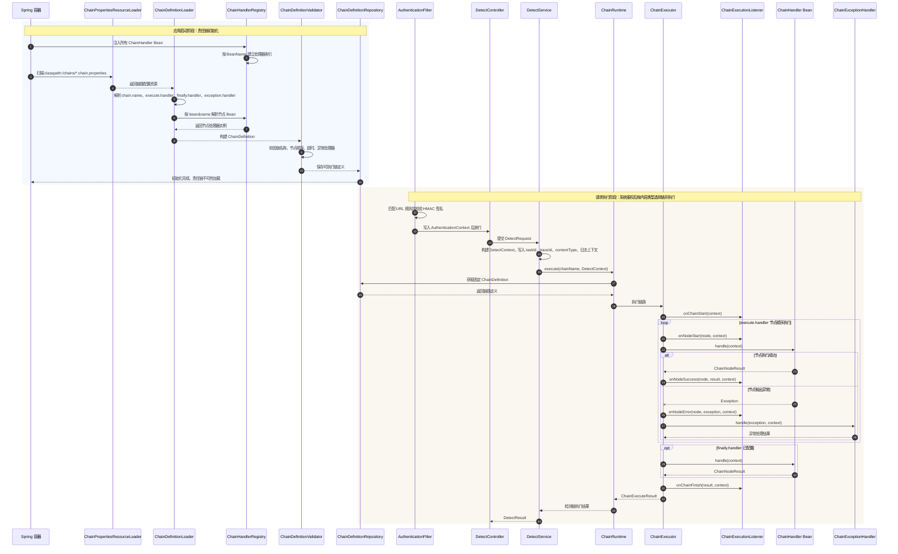

# 设计说明

## 链路路由

检测服务根据 `contentType` 选择固定链：

```text
TEXT  -> text.detect.chain
IMAGE -> image.detect.chain
AUDIO -> audio.detect.chain
VIDEO -> video.detect.chain
```

## 初始化与执行时序



## 文本链

```text
参数校验 -> 关键词检测 -> 正则检测 -> 模拟文本模型 -> finally
```

## 图片链

```text
参数校验 -> 图片下载 -> OCR -> 关键词检测 -> 模拟图片模型 -> finally
```

## 音频链

```text
参数校验 -> 音频拉取 -> ASR -> 关键词检测 -> 模拟文本模型 -> finally
```

## 视频链

```text
参数校验 -> 视频拉取 -> 抽帧/OCR -> 关键词检测 -> 模拟文本模型 -> finally
```

## 说明

图片、音频、视频节点会把 OCR、ASR、抽帧 OCR 产生的文本写入 `DetectContext.derivedTexts`，后续复用文本关键词和文本模型节点。
