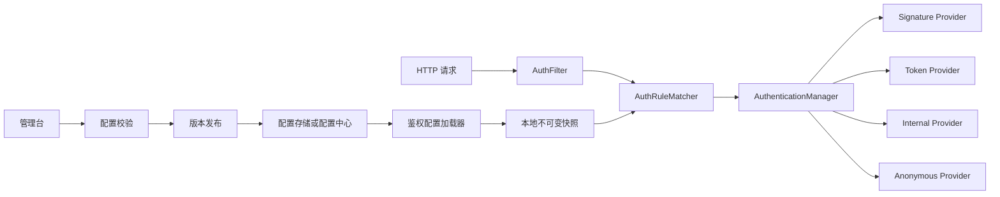
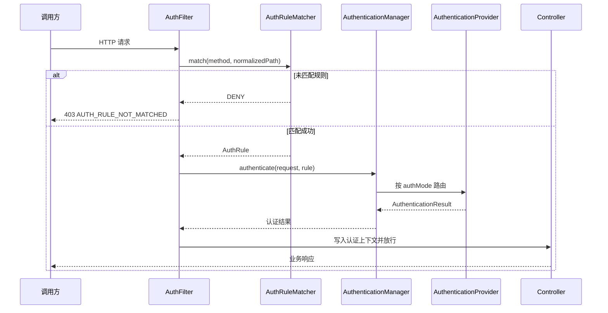

# 设计说明

## 设计原则

- 鉴权模式由服务端已发布配置决定，客户端不能指定或降级。
- 控制面与数据面分离，管理台不可用不能阻断在线请求。
- 配置先校验后发布，运行服务只读取不可变版本快照。
- 未匹配、加载失败、模式未知时默认拒绝。
- URL 路由与具体鉴权算法解耦。

## 总体架构



管理台、校验器、发布记录和配置存储属于控制面。`AuthFilter`、规则匹配器、Provider 和本地快照属于数据面。

## 鉴权规则模型

```java
public record AuthRule(
        String ruleId,
        String name,
        String pathPattern,
        Set<HttpMethod> methods,
        AuthMode authMode,
        Map<String, String> options,
        int priority,
        boolean enabled
) {
}
```

字段约束：

| 字段 | 说明 |
| --- | --- |
| `ruleId` | 规则稳定标识，发布后用于审计和定位 |
| `pathPattern` | Spring PathPattern 格式，例如 `/api/detect/**` |
| `methods` | 允许的 HTTP Method；空集合表示全部 Method |
| `authMode` | 选择对应的鉴权 Provider |
| `options` | 模式专属参数，只允许使用预定义白名单 |
| `priority` | 数值越小优先级越高 |
| `enabled` | 是否进入下一次发布快照 |

`options` 可以承载 `credentialScope`、`requiredPermission` 等非敏感参数。密钥、私钥和 Token 签名密钥不得直接保存在规则中，只保存安全存储中的引用。

## 配置快照模型

```java
public record AuthConfigSnapshot(
        String version,
        Instant publishedAt,
        String publishedBy,
        List<AuthRule> rules,
        String checksum
) {
}
```

每次发布生成唯一、不可变且可回滚的版本。`checksum` 用于检查配置传输和加载结果是否一致。服务实例对外暴露当前版本信息，但不得暴露规则中的敏感数据。

## 匹配规则

1. 使用规范化后的请求路径参与匹配，不使用原始查询字符串。
2. 同时匹配 HTTP Method 和 `pathPattern`。
3. 只在当前已发布快照内匹配 `enabled=true` 的规则。
4. 按 `priority` 从小到大选择第一条规则。
5. 同优先级规则存在重叠时禁止发布，由配置校验阶段报错。
6. 未匹配任何规则时执行 `DENY`，不默认进入 `ANONYMOUS`。
7. 一旦选中鉴权模式且认证失败，不尝试其他模式。

路径匹配使用 Spring `PathPatternParser`。加载快照时预编译路径表达式，避免每次请求重复解析。

## 核心扩展接口

```java
public interface AuthenticationProvider {
    AuthMode supportMode();

    AuthenticationResult authenticate(AuthenticationRequest request,
                                      AuthRule rule);
}

public interface AuthConfigSource {
    Optional<AuthConfigSnapshot> loadLatest();
}

public interface AuthRuleMatcher {
    MatchedAuthRule match(String method, String path);
}
```

`AuthenticationManager` 在启动时收集所有 `AuthenticationProvider` Bean，并检查一种 `AuthMode` 只能存在一个 Provider。后续增加鉴权方式时新增实现，不修改过滤器和规则匹配器。

## 请求执行流程



认证上下文必须在请求结束的 `finally` 中清理。错误响应统一使用英文异常描述和稳定错误码，内部日志记录规则 ID、快照版本、鉴权模式、appId、traceId 和失败原因。

## 管理台发布流程

规则状态建议划分为：

```text
DRAFT -> VALIDATED -> PUBLISHED -> SUPERSEDED
                \-> REJECTED
```

发布流程：

1. 管理台保存草稿，不影响线上服务。
2. 校验规则字段、PathPattern、Provider 支持情况和规则冲突。
3. 生成完整快照、版本号和 checksum。
4. 原子写入配置存储并记录发布审计日志。
5. 通过配置中心监听或消息事件通知服务实例。
6. 服务实例下载完整快照，在内存中编译并二次校验。
7. 校验成功后通过原子引用一次性替换本地快照。
8. 加载失败时保留上一有效版本并上报告警。

禁止逐条修改运行中的规则集合，否则实例可能读到不完整配置。

## 启动与故障策略

- 服务启动时优先加载远端最新已发布快照。
- 远端暂时不可用时，可以加载本地持久化的最后有效快照。
- 服务从未获得过有效快照时，除显式定义的引导端点外默认拒绝业务请求。
- 新快照非法时不覆盖当前快照，同时记录配置版本和校验错误。
- 配置长时间未更新不自动失效，但需要暴露版本年龄监控指标。
- 回滚通过重新发布历史完整快照完成，产生新的发布版本和审计记录。

## 引导规则

管理台配置尚未加载时，可能仍需要健康检查端点。引导规则必须由服务本地代码或只读启动配置定义，范围保持最小，例如：

```text
GET /actuator/health/liveness  -> ANONYMOUS
GET /actuator/health/readiness -> ANONYMOUS
```

引导规则不能覆盖业务 URL，也不能由远端配置改成更宽泛的匿名规则。

## 安全与审计

- 发布和回滚需要操作者身份、原因、时间、前后版本与差异摘要。
- `ANONYMOUS` 规则属于高风险变更，需要额外确认或审批能力。
- 管理台预览必须展示规则命中结果，支持输入 Method 和 URL 进行模拟。
- 敏感凭证由独立凭证模块或 KMS 管理，鉴权规则只保存凭证引用。
- 管理接口本身不能由同一份动态规则降级为匿名。
- 日志不得打印 secret、原始 Token、签名原文或完整签名值。

## 配置存储演进

第一阶段实现时可以使用数据库保存版本和规则，通过定时拉取或事件通知刷新；后续可以接入 Nacos、Apollo 等配置中心。业务侧只依赖 `AuthConfigSource`，不直接依赖具体配置产品。

## 与现有代码的迁移关系

本期已按以下顺序完成迁移：

1. 在 `baseSdk.auth` 中建立协议无关模型、Provider 接口和统一异常。
2. 使用 `SIGNATURE` Provider 替换与检测 DTO 耦合的旧验签器。
3. 启动时安装最小引导快照，定时读取数据库中的完整发布快照。
4. 接入 `AuthenticationFilter` 并缓存原始请求体。
5. 移除 Controller 中的显式验签调用，从认证上下文取得 appId。
6. 管理台完成后写入相同的 `system-auth/published-rules` 配置项。

检测接口需要分别配置同步提交、异步提交和异步结果查询规则。即使三者初期都使用 `SIGNATURE`，也应保留独立规则，以便分别配置权限点、限流配额和后续鉴权策略。

## 签名协议

签名原文不依赖业务 DTO，按以下字段及换行符拼接：

```text
HTTP_METHOD
NORMALIZED_PATH
APP_ID
TIMESTAMP
NONCE
SHA256_HEX(RAW_BODY)
```

客户端使用 `HMAC-SHA256` 计算小写十六进制签名。查询字符串不参与签名；时间戳使用 Unix 秒。服务端先验签再原子占用 nonce，非法请求不会污染防重放存储。

## 凭证与 RPC 演进

`CredentialProvider` 隔离凭证来源。个人开发阶段由环境变量提供凭证，后续可增加数据库密文、KMS 或 STS 实现。`AuthenticationRequest` 不依赖 Servlet；升级 gRPC 或 Dubbo 时，仅需在对应 Interceptor/Filter 中把 Metadata 或 Attachment 转换为该模型。

当前 `InMemoryNonceStore` 仅适用于单实例。多实例部署必须增加 Redis 实现，通过 `SET key value NX EX` 一类原子语义实现全局防重放。
