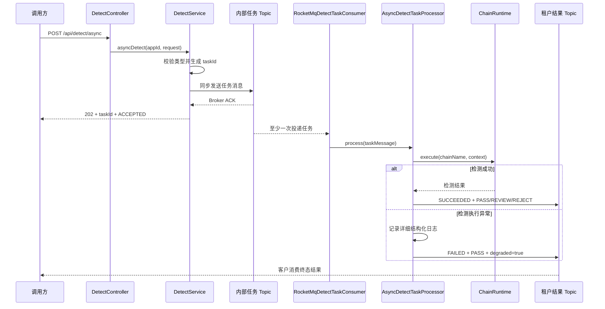

# 设计说明

## 接口与返回语义

```text
POST /api/detect/sync   -> TEXT、IMAGE
POST /api/detect/async  -> TEXT、IMAGE、AUDIO、VIDEO
```

同步接口完成责任链后返回最终结果。异步接口只有在 RocketMQ Producer 获得 Broker 回执后才返回 `202 Accepted`；消息发送失败返回明确的服务不可用错误。

请求中的 `clientRequestId` 是可选客户关联字段，不参与平台唯一性约束。服务端生成：

```text
taskId  -> dt_{uuid}
eventId -> evt_{uuid}
traceId -> trace_{uuid}
```

## 执行流程



结果消息发送失败时，消费者向 RocketMQ 返回 `FAILURE`，由 RocketMQ 重投原任务。检测失败但降级结果发送成功时返回 `SUCCESS`。

## Topic 与隔离

```text
内部任务 Topic：content-detect-task
租户结果 Topic：detect-result-{tenantHash}
内部消费组：content-detect-worker
```

`TenantResultTopicResolver` 使用 `SHA-256(appId)` 的前 8 字节生成稳定十六进制租户标识，避免在 Topic 中暴露原始 `appId`。生产环境需要预先创建对应 Topic，并为客户发放只能订阅自身 Topic 的独立 ACL 凭证。

## 消息语义

- `taskId` 表示一次检测任务，作为 RocketMQ Message Key。
- `eventId` 表示一次消息事件。
- 客户重复提交会生成不同 `taskId`，属于不同任务。
- MQ 重投保留相同 `taskId`，可能造成重复检测和重复结果。
- RocketMQ 不根据 `taskId` 覆盖消息，客户按 `taskId` 幂等消费终态结果。
- 第一版不引入任务数据库、Redis 或 Outbox。

## 故障开放

同步检测执行异常时返回：

```json
{
  "taskId": "dt_xxx",
  "detectStatus": "FAILED",
  "action": "PASS",
  "degraded": true,
  "errorCode": "DETECT_EXECUTION_FAILED",
  "errorMessage": "Detection execution failed"
}
```

异步检测执行异常时发送同等语义的 `CONTENT_DETECT_FAILED` 结果消息。参数错误、鉴权失败和任务消息未写入 Broker 不属于检测故障，必须明确返回错误。

## 日志与 Elasticsearch

同步、异步、责任链和消息发布过程都通过 `LogRecorder` 输出 `BaseLogEvent`。日志包含 `traceId`、`taskId`、`appId`、`sceneCode`、事件类型、异常类型和耗时，不对外返回责任链节点结果。

Elasticsearch 后续通过新增 `LogSink` 接入，只用于日志检索、告警和故障追踪，不作为任务状态真相源。日志不得记录 App Secret、完整签名、Token 或未脱敏内容。

## 本地与生产配置

本地默认使用 `LoggingDetectTaskPublisher` 和 `LoggingDetectResultPublisher`，便于无 Broker 启动和测试。生产环境设置：

```text
DETECT_ASYNC_PUBLISHER=rocketmq
ROCKETMQ_ENDPOINTS=...
ROCKETMQ_ACCESS_KEY=...
ROCKETMQ_SECRET_KEY=...
ROCKETMQ_TASK_TOPIC=content-detect-task
ROCKETMQ_CONSUMER_GROUP=content-detect-worker
ROCKETMQ_RESULT_TOPIC_PREFIX=detect-result-
```

RocketMQ 适配器基于官方 5.x gRPC Java SDK，Broker 需要启用兼容的 Proxy。
